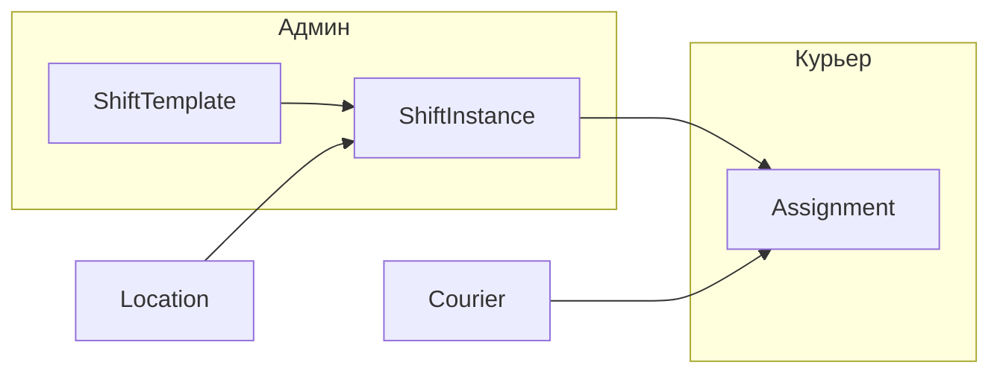

# Проектирование программы самозаписи курьеров на смены

## Цель и сценарий по умолчанию

Под «самостоятельным распределением» здесь понимается: **курьер из списка открытых слотов бронирует смену**, соблюдая лимиты (на человека, на точку, на день), **окна открытия** (например, запись на следующую неделю с понедельника) и **политику отмен**. Администратор задаёт календарь смен, зоны/склады и правила. Альтернативы (обмен сменами, чисто алгоритмическое назначение) — отдельные модули поверх той же модели данных.

Рабочая область [c:\Ramnas\work\vkusvill-queue](c:\Ramnas\work\vkusvill-queue) сейчас без кода (есть только ODS) — проектирование можно вести **с нуля**, с прицелом на API-first (веб или бот станут клиентами).

---

## Участники и границы системы

| Роль | Действия |
|------|----------|
| Курьер | Просмотр доступных слотов, бронь, отмена по правилам, (опционально) очередь ожидания |
| Супервизор/админ | CRUD слотов и шаблонов недели, блокировки, ручные назначения, отчёты |
| Система | Проверка конкурентных броней, уведомления, аудит |

Внешние системы (если появятся): HR/табель, маршрутизация, зарплата — только **интеграция событиями** (webhook / очередь), не дублирование их логики в ядре.

---

## Доменная модель (ядро)

Минимальные сущности:

- **Courier** — идентификатор, статус (активен/заблокирован), привязка к зонам/складам (many-to-many).
- **Location / Hub** — точка выхода на линию (склад, зона доставки).
- **ShiftTemplate** — повторяющийся шаблон (день недели, интервал, длительность, `location`, требуемая численность).
- **ShiftInstance** — конкретное окно на дату-время, `capacity` (сколько мест), `booked_count`, флаги «закрыто админом».
- **Assignment (бронь)** — связь `courier` + `shift_instance`, статус (`confirmed`, `cancelled_by_courier`, `cancelled_by_admin`), временные метки; **уникальность** на пару активная бронь ↔ слот для одного курьера на пересекающееся время (см. ниже).
- **BookingWindowRule** — с какого момента открывается слот для записи, ограничения «не раньше N дней».
- **AuditLog** — кто и что изменил (слоты, брони, правила).

Пересечение смен: для одного курьера нельзя две активные брони с пересекающимися интервалами `[start, end)` — проверка на уровне транзакции при создании брони.

---

## Ключевая бизнес-логика (сервисный слой)

1. **Список доступных слотов** — фильтр по зоне курьера, дате, `booked_count < capacity`, слот не закрыт, наступило окно записи.
2. **Бронирование** — транзакция: `SELECT FOR UPDATE` на строку `shift_instance` (или аналог), инкремент занятых мест, вставка `assignment`; откат при нарушении пересечения или лимитов.
3. **Лимиты** (настраиваемые): макс. смен в неделю на курьера, макс. подряд, минимальный отдых между сменами — проверка до фиксации.
4. **Отмена** — дедлайн (например, не позже чем за 12 ч); при отмене — освобождение места; опционально уведомление очереди ожидания.
5. **Очередь ожидания** (опционально v2): при переполнении — запись в waitlist; при освобождении — атомарно первый в очереди получает слот (с таймаутом на подтверждение).

Конкуренция: несколько курьеров бронируют последнее место — побеждает одна транзакция; остальные получают понятную ошибку «мест больше нет».

---

## Архитектура приложения

Рекомендация: **монолитное API** (например Node/Nest, Python/FastAPI, Go) + одна реляционная БД (PostgreSQL). Клиенты: SPA/PWA или Telegram-бот — тонкие, вызывают одни и те же эндпоинты.

Минимальные модули:

- `auth` — идентификация курьера и админа (JWT или сессии + RBAC).
- `shifts` — шаблоны, инстансы, массовая генерация недели из шаблонов (cron/job).
- `bookings` — бронь, отмена, мои смены.
- `notifications` — очередь исходящих (push/SMS/Telegram) по событиям.
- `admin` — отчёты по незакрытым слотам, экспорт.

События для интеграций: `assignment.created`, `assignment.cancelled`, `shift.capacity_changed` — публиковать в шину или таблицу outbox для надёжной доставки.

---

## API (черновой контракт)

- `GET /couriers/me/shifts/available?from=&to=&locationId=`
- `POST /couriers/me/assignments` — body: `{ shiftInstanceId }`
- `DELETE /couriers/me/assignments/:id` — отмена по правилам
- `GET /couriers/me/assignments` — мои подтверждённые смены
- Админ: CRUD шаблонов/инстансов, `POST /admin/shifts/generate-week`, ручное назначение

Все мутации — идемпотентность через `Idempotency-Key` на бронь (защита от двойного тапа на мобилке).

---

## Нефункциональные требования

- **Аудит** обязателен для споров («кто снял смену»).
- **Часовые пояса**: хранить слоты в UTC, отображать в локали точки/курьера.
- **Нагрузка**: пики в момент открытия окна записи — кэш read-only списка + короткие транзакции на запись.

---

## Этапы внедрения

1. **MVP**: курьер + админ, слоты вручную/генерация из шаблона, бронь/отмена, базовые лимиты, без очереди ожидания.
2. **v1.1**: waitlist, уведомления, экспорт для табеля.
3. **v2**: обмен сменами (двухстороннее подтверждение или модерация), интеграции.

---

## Что уточнить перед реализацией (когда будете готовы)

- Точный сценарий: только самозапись или ещё обмен/алгоритм.
- Обязательные лимиты и юридические ограничения по сменам в вашей юрисдикции.
- Предпочитаемый стек и канал для курьеров (веб vs Telegram).

После утверждения этого плана можно перейти в режим реализации: выбрать стек, создать репозиторий в [c:\Ramnas\work\vkusvill-queue](c:\Ramnas\work\vkusvill-queue), схему БД и скелет API.
